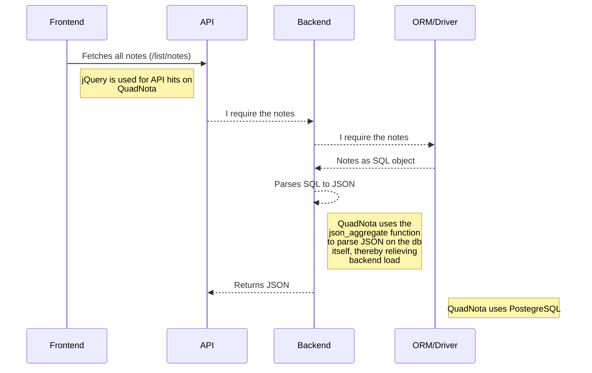

 

 

# QUADNOTA-C
A clean and minimal **notes and todo webapp** with RESTful APIs and a **C backend**.
> Frontend Stack: `HTML/ CSS/ SAAS/ Bootstrap5` 
> Backend Stack: `C/ Libpq/ Ulfius/ PostgreSQL`

## The Design
QUADNOTA takes on a design experience inspired by the perspex in nature. Gentle curves flow along transparent tiles that let you see what's behind, as a soothing blur encaptures your attention towards itself.

This accessibility-oriented development of the UI allows for a more relaxed experience.

## DEMO
A complete demo of QUADNOTA is available [here (quadnota.deltaonealpha.dev)](https://quadnota.deltaonealpha.dev/)

## Installation
#### Compiling from source - direct
###### Backend
- Clone the GitHub repository
- Prepare a PostgreSQL database with tables:
    - "notes" (columns: id SERIAL (AUTOINCREMENT), header VARCHAR, bodypayload VARCHAR)
    - "todo" (columns: id SERIAL (AUTOINCREMENT), bodypayload VARCHAR)
- Change database credentials accordingly and compile source under the backend folder with GCC by passing includes:
`gcc -o test test.c -I/usr/include/postgresql -lpq -std=c99 -lulfius`

`🔴 Note: Building QuadNota from source requires C99+, libpq-dev and ulfius installed`

###### Frontend 
Clone the GitHub repository and static host files under the frontend folder after changing API endpoints with jQuery depending on your backend deployment state.

#### Compiling from source - CMake
To compile QuadNota with CMake, clone this repository and build with CMake after adding CMake source compilations for the following headers:
- ulfius
- libpq 

`🔴 Note: This implementation of QuadNota-C has the header file libpq-fe.h's location hardcoded. This may have to be altered depending on your localized deployment state.`

## Logic Flow
The following sequence diagram shows the flow of logic behind QUADNOTA's working:

` Note: The above code can be visualized as a diagram by installing the Mermaid browser extension for GitHub.`

## License
This project is licensed under the MIT Public License. For more information, read [LICENSE](/LICENSE). 

## Privacy Statement
The application logs basic network telemetry.
