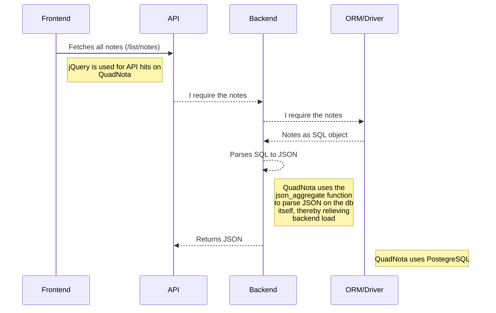

 

 

# QUADNOTA
A clean and minimal **notes and todo webapp** with a backend written in **vanilla C**.
> Frontend Stack: `HTML/ CSS/ SAAS/ Bootstrap5` 
> Backend Stack: `C/ Libpq/ Ulfius/ PostgreSQL`

`🔴 Note: Building QuadNota from source requires C99+`

## The Design
QUADNOTA takes on a design experience inspired by the perspex in nature. Gentle curves flow along transparent tiles that let you see what's behind, as a soothing blur encaptures your attention towards itself.

This accessibility-oriented development of the UI allows for a more relaxed experience.

## Logic Flow
The following sequence diagram shows the flow of logic behind QUADNOTA's working:

## License
This project is licensed under the MIT Public License. For more information, read [LICENSE](/LICENSE). 
